# Popularity Prediction using Spotify Features
Authors: Dillon Diatlo, Elaine Chen, Harnish Shah, Rajashree Choudhary

## Role
* Data Cleaning
* Data Visualization
* Data Modeling (build, train, validate)
* Presentation

## Problem Statement

In the expansive domain of [Spotify](https://www.spotify.com/), a platform that serves as a hub for global music communities and boasts a diverse repertoire of genres, the objective is to predict the popularity using songs released prior to 2019. This entails analyzing song features within Spotify's structure to anticipate their acclaim. Utilizing Spotify's vast database and insights into each song's characteristics, the aim is to discern the elements contributing to a song's success. Exploring factors such as genre, danceability, valency, and tempo etc, this predictive analysis seeks to unveil prevalent patterns and trends in the music landscape up to 2018. Ultimately, this exploration offers a means to comprehend and forecast the resonance of songs within Spotify's diverse and dynamic ecosystem.

## Data Dictionary

|Feature|Type|Description|Range|
|---|---|----|---|
|acousticness|*float*|A confidence measure from 0.0 to 1.0 of whether the track is acoustic. 1.0 represents high confidence the track is acoustic.|0 - 1|
|danceability|*float*|Danceability describes how suitable a track is for dancing based on a combination of musical elements including tempo, rhythm stability, beat strength, and overall regularity. A value of 0.0 is least danceable and 1.0 is most danceable.|0 - 1|
|duration_min|*float*|The duration of the track in minutes.| |
|energy|*float*|Energy is a measure from 0.0 to 1.0 and represents a perceptual measure of intensity and activity. Typically, energetic tracks feel fast, loud, and noisy. Perceptual features contributing to this attribute include dynamic range, perceived loudness, timbre, onset rate, and general entropy.|0 - 1|
|instrumentalness|*float*|Predicts whether a track contains no vocals. "Ooh" and "aah" sounds are treated as instrumental in this context. Rap or spoken word tracks are clearly "vocal". The closer the instrumentalness value is to 1.0, the greater likelihood the track contains no vocal content.|0 - 1|
|key|*integer*|The key the track is in. Integers map to pitches using standard Pitch Class notation. If no key was detected, the value is -1.|-1 - 11|
|liveness|*float*|Detects the presence of an audience in the recording. Higher liveness values represent an increased probability that the track was performed live. A value above 0.8 provides strong likelihood that the track is live.|0 - 1| 
|loudness|*float*|The overall loudness of a track in decibels (dB). Loudness values are averaged across the entire track and are useful for comparing relative loudness of tracks. Values typically range between -60 and 0 dB.|-60 - 0 dB|
|mode|*integer*|Mode indicates the modality (major or minor) of a track, represented by 1 for major and 0 for minor.|0 - 1|
|speechiness|*float*|Speechiness detects the presence of spoken words in a track.|0 - 1|
|tempo|*float*|The overall estimated tempo of a track in beats per minute (BPM).| | 
|time_signature|*integer*|An estimated time signature, ranging from 3 to 7.|3 - 7|
|track_href|*object*|A link to the Web API endpoint providing full details of the track.| | 
|type|*object*|The object type, which must be "audio_features". | |                    
|valence|*float*|A measure from 0.0 to 1.0 describing the musical positiveness conveyed by a track.|0 - 1|
|population|*object*|A 0-to-100 score that ranks how popular an artist is relative to other artists on Spotify.|0 - 100|
|genre|*object*|The genre of the track| |

## Executive Summary

### Project objective

We will leverage Spotify's features database to categorize songs into popularity groups based on the following ranges:

- Popularity 0-20: Least popular
- Popularity 21-40: Less popular
- Popularity 41-60: Medium popular
- Popularity 61-80: More popular
- Popularity 81-100: Most popular

### Methodology

The methodology involves several steps:

1. Data Cleaning:
    - Impute missing track name
    
2. Exploratory Data Analysis (EDA):
    - Each Spotify track features correlation
    - Popularity distribution
    - Numerical features statisticical summary
    - Categorical features distribution
    - Top artists, top songs exploratory
    
3. Feature Engineering
    - Transpose feature genre, to remove records that same song marked in different genre
    
4. Train-Test Split:
    - The dataset is divided into training and testing sets to assess model performance accurately.

5. Model Selection:
    - Several classification algorithms are utilized for model training, including Clustering, Desicion Tree Classification, Random Forest Classification, ExtraTrees Classification and Neural Network 
    
6. Model Evaluation:
    - Each classification model is trained using the training data and evaluated using testing data.
    - Model performance metrics such as training score, testing score, and accuracy is calculated to assess the effectiveness of each model.

### Plots

#### Features
Heatmap: Numeric Feature Correlations 
* Looking at feature correlations to narrow down which variables to use when predicting popularity
* Feature correlation can also help determine co-linearity and bias
  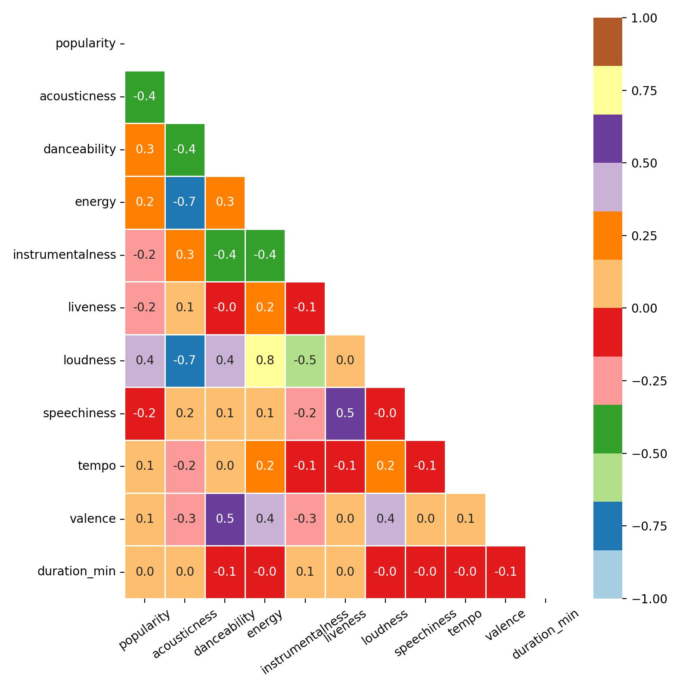

Feature Relationships: Energy and Acousticness
* Looking at feature correlations can help to determine co-linearity and bias
* Trend: As acousticness goes up, energy decreases
  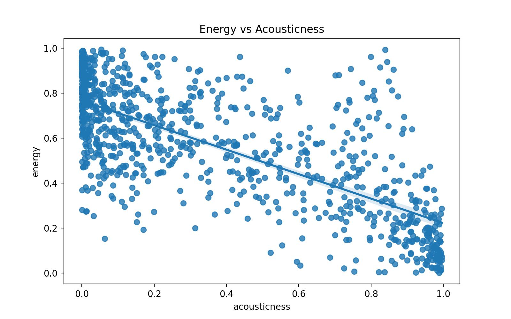

Feature Relationships: Energy and Loudness
* Looking at feature correlations can help to determine co-linearity and bias
* Trend: Energy and loudness have a clear positive correlation
  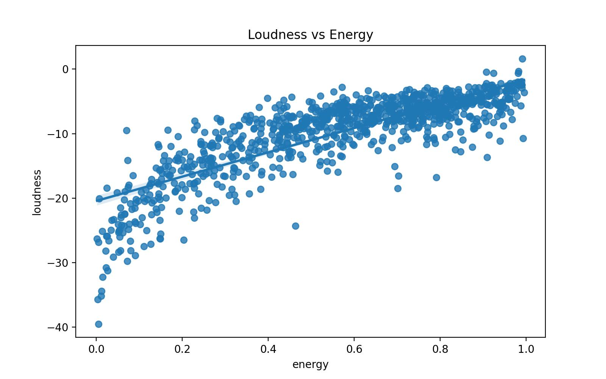

Feature Relationships: Loudness and Acousticness
* Looking at feature correlations can help to determine co-linearity and bias
* Trend: As acousticness goes up, loudness decreases, confirming previous two visualizations
  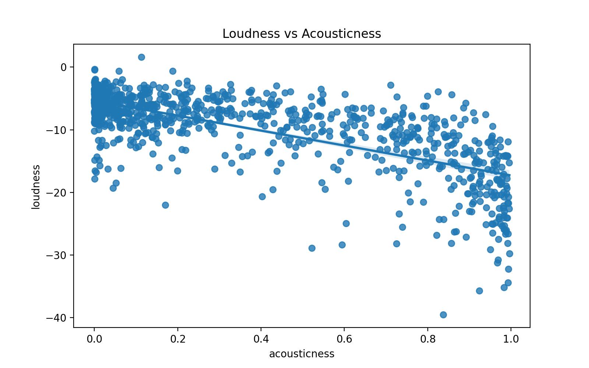

#### Genre
Distribution of Songs by Genre
  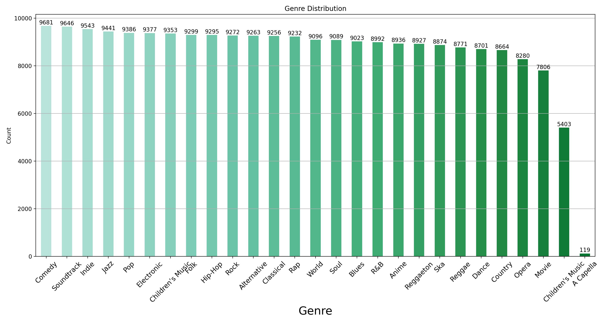

Song Duration by Genre
  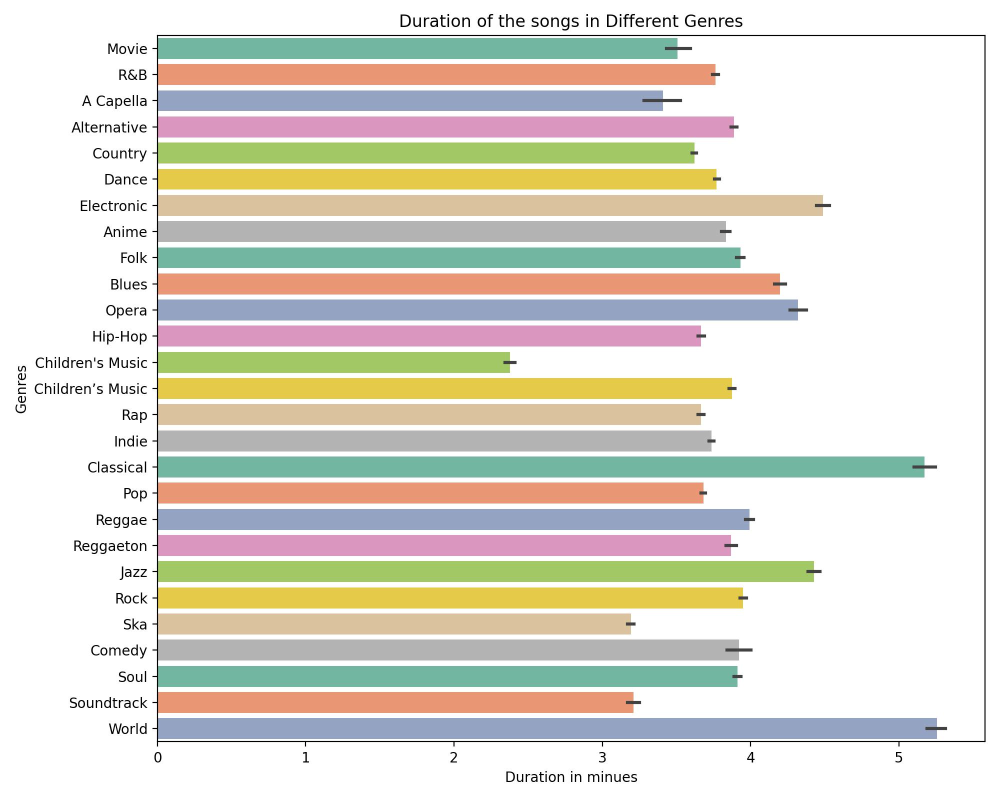

Violin Plot: Energy by Genre
* Here you can see that each genre can often be determined by where a songs energy level fits
  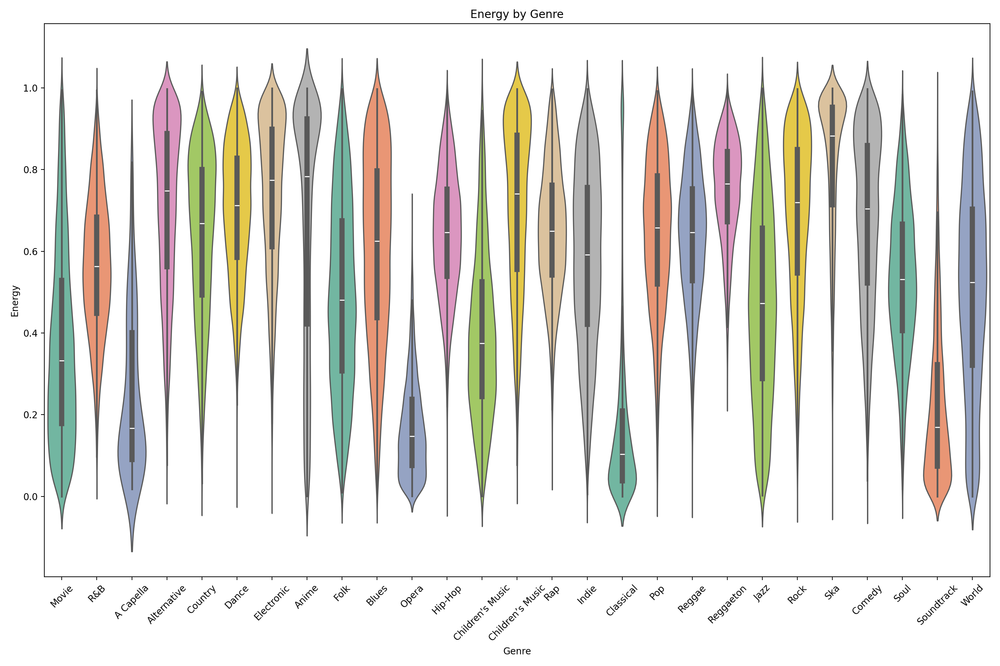

#### Popularity
Distribution of Songs by Popularity Ranking
* Most songs have a mid-range popularity ranking, making it difficult to create a model that can accurately predict popularity
* We see a bimodal trend here because just under 8k songs have not been ranked at all, most likely due to the nature of of how many songs are on Spotify and never really listened to
  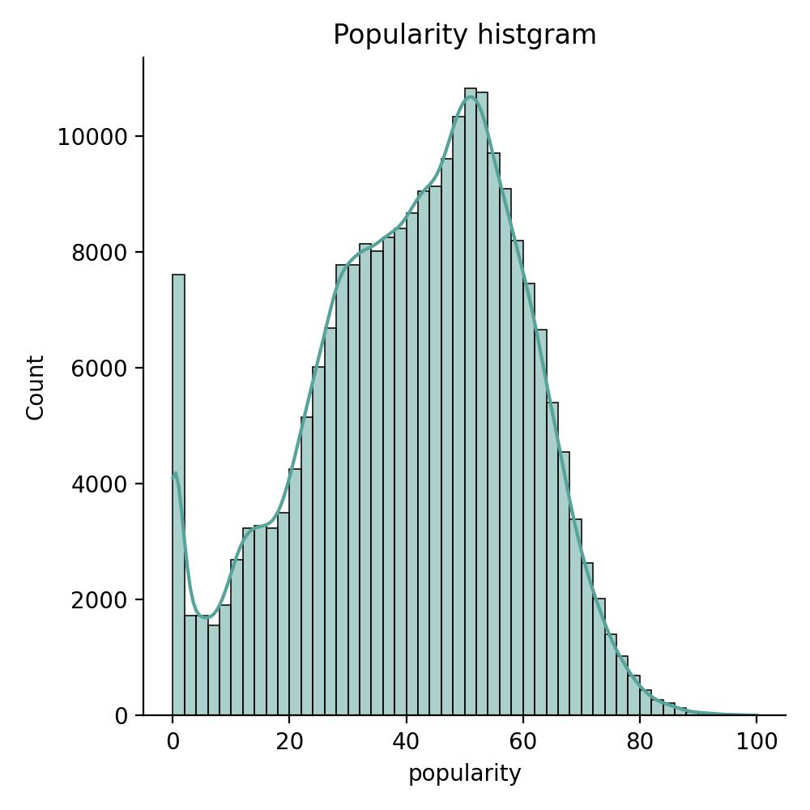

Heatmap: Popularity Feature Correlations
* Loudness is the feature that correlates with popularity most
  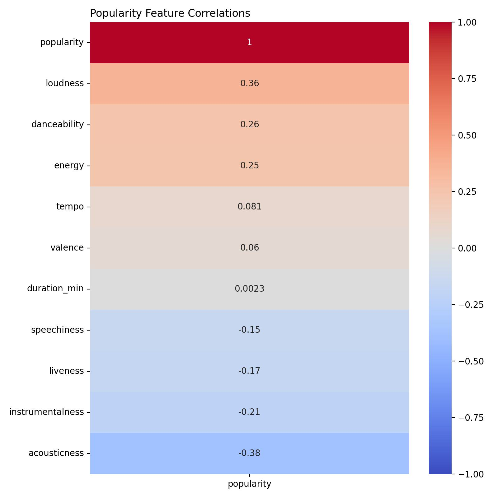

Popularity by Loudness
* Most popular songs seem to land between -10 and -5 decibels 
  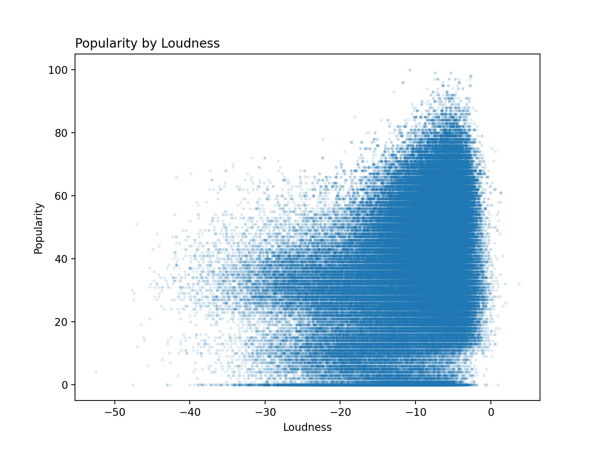

Distribution of Key by Popularity
* Songs in the key of C tend to be the most popular, followed by G and D (though I suppose any punk music fan could have told you that!)
  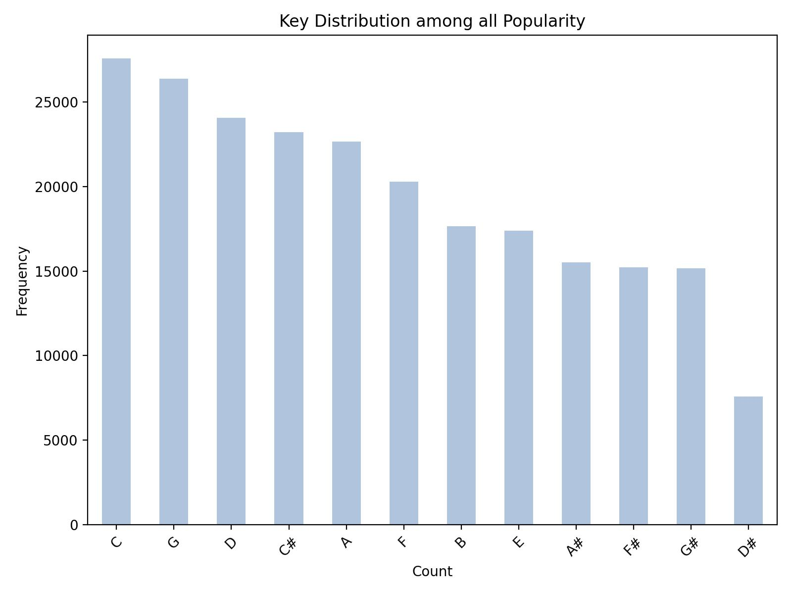

Top 10 Most Popular Spotify Songs
* We see here a bias in the data, since the same songs fall under multiple genres the top 10 most popular songs are only 5 songs
  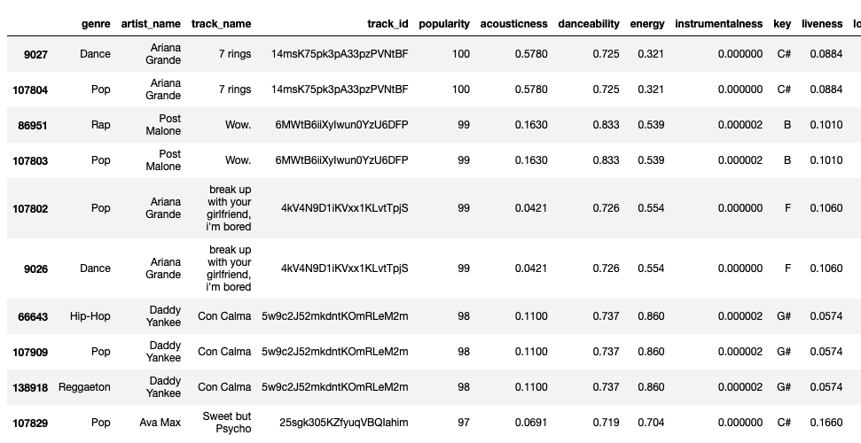

Top 10 Least Popular Spotify Songs
* In the wise words of Rodney Dangerfield, Ludwig van Beethoven gets "No respect!"
  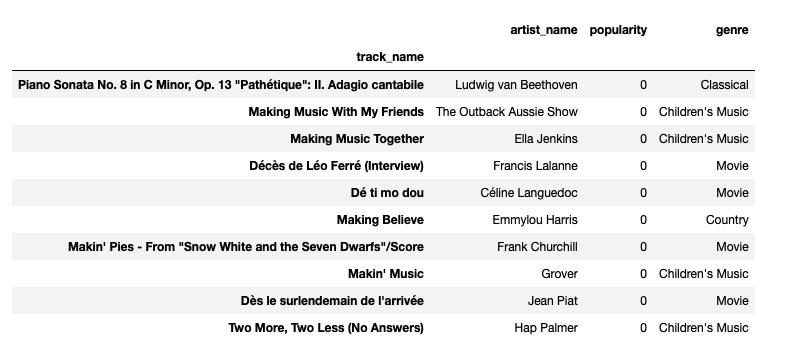

Top 20 Most Popular Spotify Artists
  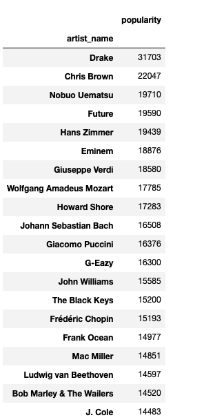

### Conclusion and Recommendations

#### Conclusion
Our analysis revealed several key insights regarding the classification of song popularity using machine learning algorithms. Initially, through k-means clustering, we determined the optimal number of clusters, which informed our grouping of popularity into three classes. Subsequent experimentation with classification algorithms highlighted Random Forest as the top performer, achieving impressive training and testing scores. However, we identified a challenge with imbalanced popularity classes, particularly within the range of 34 to 66. To address this, we refined our approach by dividing popularity into five classes and employing a Dense Neural Network (DNN), resulting in improved accuracy rates. Overall, these findings underscore the importance of careful feature selection and addressing data imbalances to enhance the effectiveness of predictive models in classifying song popularity.

#### Recommendations
- The dataset displays an imbalance, notably in the most popular group (Popularity: 81 to 100). Future studies should prioritize acquiring more up-to-date and balanced data to ensure robust analysis and accurate predictions.
- Given the limitations in data extraction due to Spotify's updated user safety policy, we had restricted access to the latest dataset. For improved insights, future studies should collaborate directly with Spotify to access real-time data sources, enabling access to up-to-date information for analysis and decision-making.