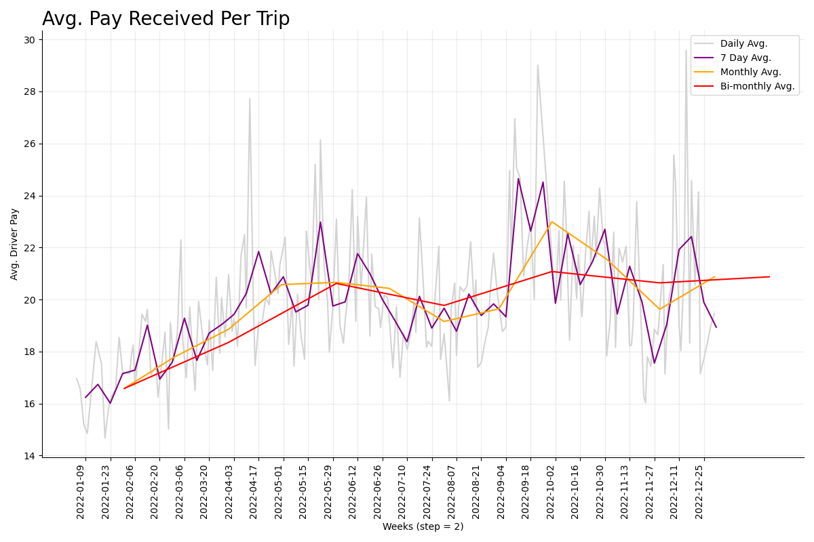
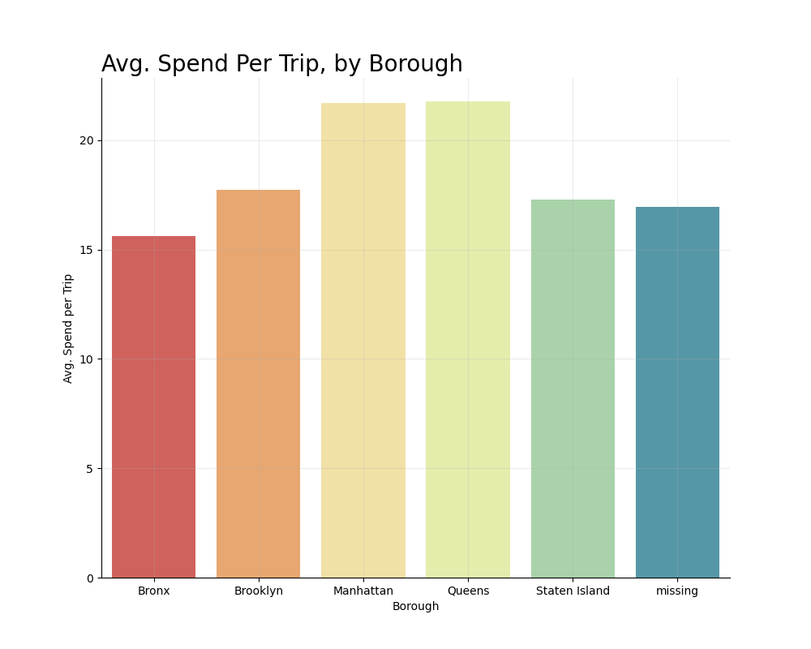
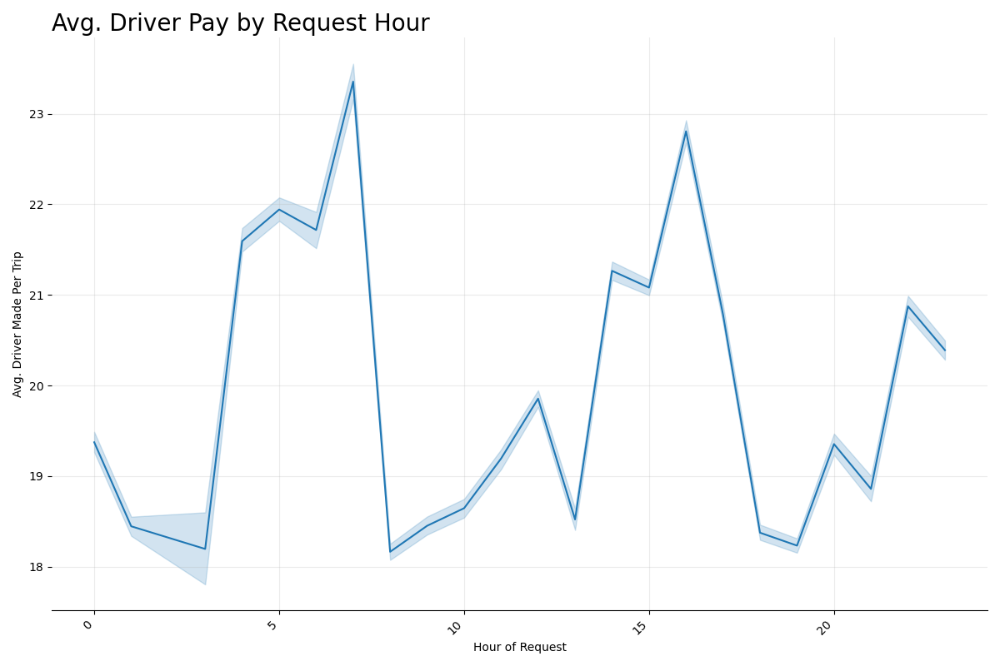
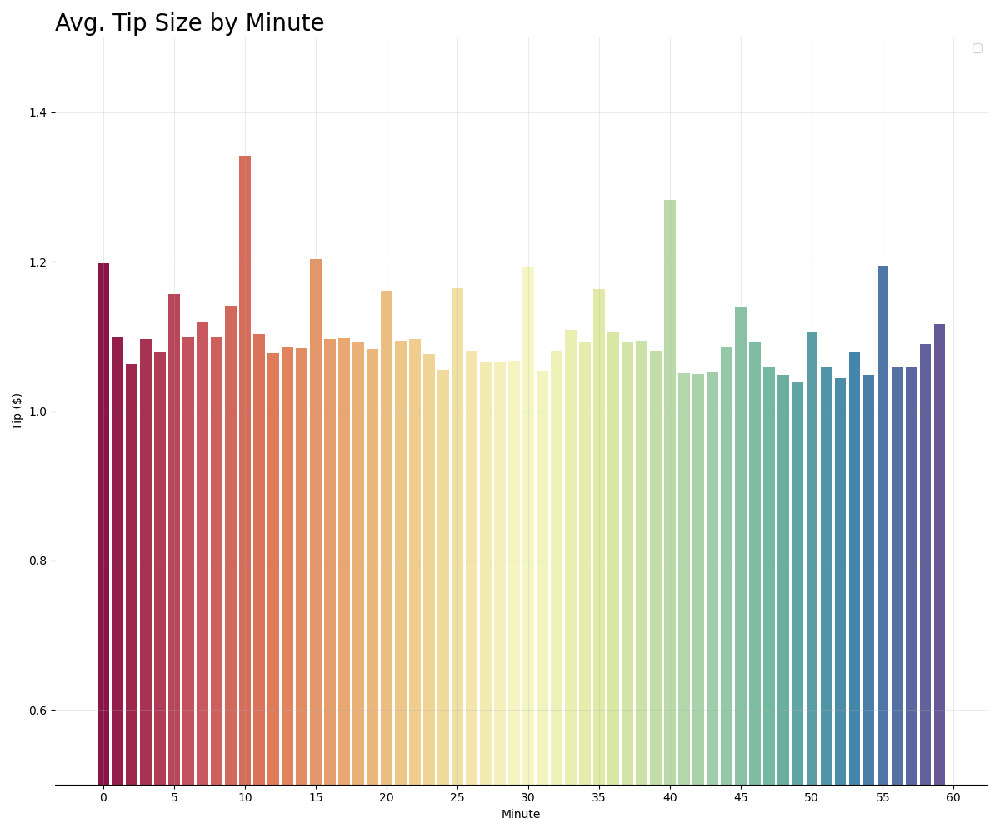
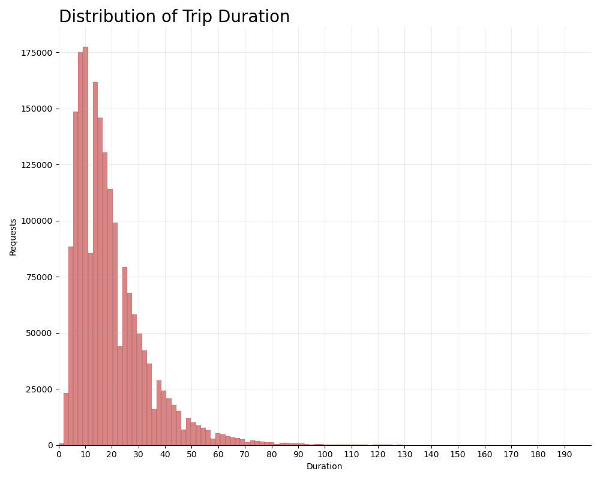
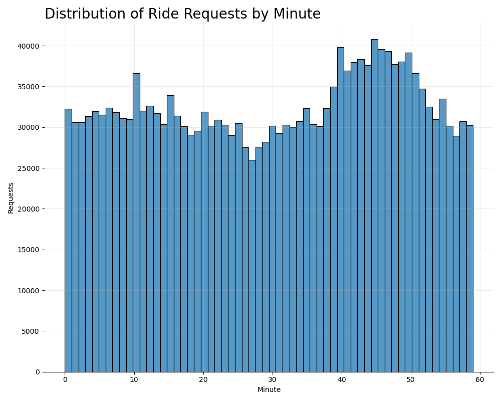
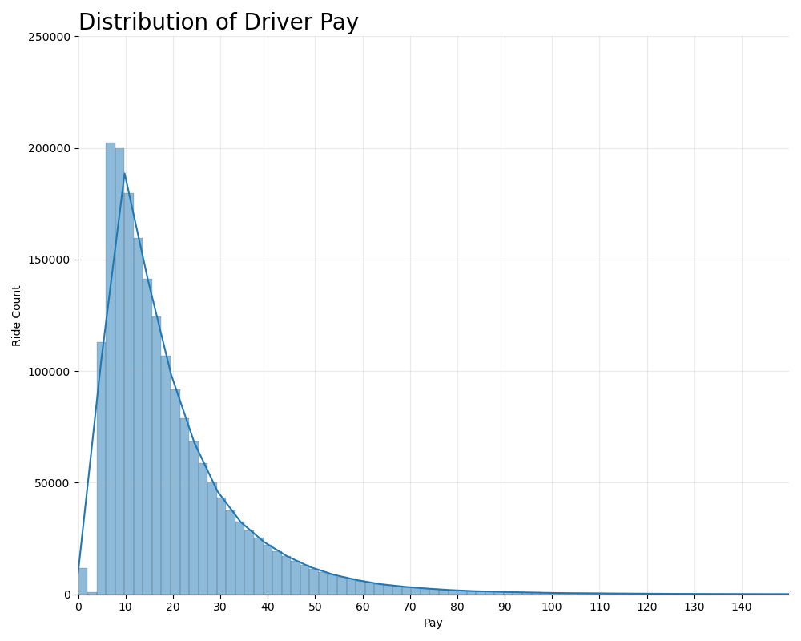

# Fare Forecaster: Save Time, Make Money
By Dillon Diatlo

## Problem Statement

In the world of NYC for-hire vehicle drivers, high-fare trips are few and far between. But maybe they don't have to be. The objective of this experiment is to sample 212 million rows of data from 2022 NYC cab trips to predict––by borough and time––which taxi zones will have on average the highest paying trips. Exploring features such as request time, weather, trip duration, date, and many more, the hope is to expose patterns contributing to high-fare rides in order to enable NYC drivers to optimize their time and make the most money possible. 

## Data Dictionary

| Feature               | Type    | Dataset        | Description                                                                                      |
|-----------------------|---------|----------------|--------------------------------------------------------------------------------------------------|
| **req_index**         | *datetime* | 041324_taxi_recs | The dataframe index representing the day of each trip     
| **trip_miles**        | *float*   | 041324_taxi_recs | The distance of every for-hire-vehicle trip 
| **tips**              | *float*   | 041324_taxi_recs | The money each passenger tipped the driver 
| **congestion_surcharge** | *float* | 041324_taxi_recs | An additional passenger surcharge given when taking a trip during a busy time of day  
| **temp**              | *float*   | 041324_taxi_recs | The temperature of NYC  
| **preciptype**        | *int*     | 041324_taxi_recs | What the weather precipitation was like, represented as follows:                                  |                                         |
|                       |           |                | 'missing': 0, 'rain': 1, 'snow': 2, 'rain,snow': 3, 'rain,freezingrain,snow': 4, 'rain,freezingrain,snow,ice': 5, 'rain,freezingrain': 6  |                                            |
| **zone**              | *object*  | 041324_taxi_recs | Which NYC taxi zone the trip began in (there are 265 unique zones)
| **borough_name**      | *object*  | 041324_taxi_recs | Which NYC borough the trip began in
| **trip_duration**     | *float*   | 041324_taxi_recs | The length of time a trip took from pickup to dropoff 
| **month**             | *int*     | 041324_taxi_recs | The month a trip took place in
| **day_of_month**      | *int*     | 041324_taxi_recs | A number between 1-31 representing which day of the month the trip took place 
| **driver_made**       | *float*   | 041324_taxi_recs | The total amount the driver made after employer charge, includes tip 
| **day_of_week**       | *object*  | 041324_taxi_recs | The day of the week the trip took place 
| **hour**              | *int*     | 041324_taxi_recs | The hour in which the trip was requested and began 
| **minute**            | *int*     | 041324_taxi_recs | The minute of the hour at which the trip was requested 

## Original Data Source
<https://data.cityofnewyork.us/Transportation/2022-High-Volume-FHV-Trip-Records/g6pj-fsah/about_data>

## Executive Summary

### Project objective

**Problem Statement:**
The objective of this experiment is to use 212 million rows of data from 2022 NYC cab trips to predict––by borough and time––which taxi zones will have on average the highest paying trips.

**Goals:**
The goal of this project is to build a working tool for-hire vehicle drivers in NYC can use to optimize their income and time.

### Methodology

The methodology involves several steps:

1. *Data Downsizing*
    - Downloaded 212,000,000 rows of data in half-month sizes
    - Used Pandas "chunksize" parameter to downsize each hal=fmonth dataframe during import
    - Concatenated the downsized half-month dataframes into 12, downsized full-month dataframes

2. *Data Cleaning*
    - Created a new dataframe of all 12 dataframes
    - Replaced and dropped NaNs
    - Transformed object-type data into datetime
    - Set the index as dates for time series analysis
    - Dropped unnecessary columns
    
3. *Exploratory Data Analysis (EDA):*
    - Reset the df index for time series analysis
    - Created heatmaps to uncover any unexpected correlations
    - Explored data by day, week, and month to spot trends
    - Analyzed data by NYC Borough through bar graphs and box plots
    - Investigated distribution of driver pay and more via histograms
    - Looked for correlations via scatter plots
  
4. *Feature Engineering*
    - Created a "driver_made" column by combining 'tips' with 'driver_pay'
    - Extracted hour, minute, and date columns to explore distributions and trends
    - Used ordinal mapping on borough names and precipitation
    - Built a 'trip_duration' column by subtracting dropoff_time by pickup_time
    - OneHotEncoded zones in a prepocessing pipeline
    - Dropped missing values and encoded others
    - Scaled features to more accurately find patterns when modeling
    
5. *Sampling*
    - Further sampled data with .sample() method to speed model exploration process
   
6. *Train-Test-Split*
    - Divided data into training and testing sets to assess model performance and accuracy

7. *Model Selection*
    - Built and tested 4 different model types
    - Tuned parameters of the 4 different model types and many pipelines to improve accuracy scores
    - Models tested:
        - GradientBoost (winner)
        - RandomForest
        - LassoCV
        - RidgeRegression
        - LinearRegression
        - XGBoost 
    
8. *Model Evaluation* 
    - Fit models with training data and ran models with testing data
    - Analyzed model performance via metrics including R^2 score, MSE, and RMSE
    - Pickled the model with the best evalutaiton

9. *Streamlit Tools*
    - Constructued a Streamlit web application for real-time use of the model
    - Illustrated and thematically fit the application
    - Deployed the application

### Key Findings & Plots

* The following features via a GradientBoostRegressor supported the the most accurate predictive model with 87% R^2 score:
    * trip_miles, congestion_surcharge, temp, preciptype, zone, borough_name, trip_duration, month, day_of_month, day_of_week, hour, minute

* Driver pay per trip tends to increase during the first 5 months of the year, before plateauing at an average of about $21
  

* The borough with the highest driver-pay per trip is Queens (by a slight margin), then Manhattan, Brooklyn, Staten Island, and the Bronx
  
  * This is most likely because JFK International Airport is in Queens and on average has the highest driver-pay per trip by month
  
* Average driver pay by request hour is bi-modal, with highest average pay around 7am and 4pm, with a slight spike in pay around 9pm
  

* Size of the average tip given peaks every 5 minutes, beginning at the bottom of the hour, with request minute 10 providing on average the largest tip per trip
  

* Most trips fall under 25 minutes in length, with the highest amount of trips around 8-10 minute range
  

* Ride requests hit a low around the 30 minute mark of the hour and peak around the 45 minute mark
   

* Drivers make between $5-$15 for the majority of their trips
  

## Conclusion and Recommendations

#### Conclusion
The analysis of this 212M-rowed dataset revealed a number of key insights regarding for-hire vehicle metrics in NYC.

First and foremost, I hit an immediate bump in the road, finding it necessary to sample the data from 212M rows to about 4M which. While sufficient, this is only about 2% of the original data. However, if not sampled, the initial dataset proved difficult and timely to work with––undescoring the importance of using tools like Spark, TensorFlow, DataBricks, and BigQuery.

By manipulating the data through Python, Pandas, Matplotlib.pyplot and more, I was able to determine, by borough, which taxi zone would produce the highest average revenue per trip. The model which performed best was a pipeline including StandardScaler and OneHotEncoder transformers paired with a GradientBoostRegressor estimator. This model achieved an impressive testing score of 87% accuracy in predicting revenue a driver might make per trip, in a given taxi zone––down to a given minute.

Pickling this model and pairing it with Streamlit tools proved efficient in building an audience-facing applicaiton that, when given the borough, weather, and more, can return the taxi zone in that borough where a driver can make the most money.

Overall, the findings reinforce the importance of location and time in determining the average revenue for a driver per trip, with less weight-carrying, though still important features, like congestion and temperature.

#### Recommendations & Next Steps

1. <ins>TOOLS</ins> - Because of the sheer size of the data available, future experiments should utilize tools built for large-scale datasets, like Spark or BigQuery, to ensure analysis of all data.

2. <ins>TIMESPAN</ins> - The for-hire vehicle data was limited to a single year (2022). Improved metrics, as well as deeper and more confident insights can be found through multiple years of data.

3. <ins>GEO-GRANULARITY</ins> - While currently specified by one of 265 NYC taxi zones, more granular geo-location data can create more specific recomendations within taxi zones, possibly down to requests by block.

4. <ins>BIASIS</ins> - Initially not biases, downsizing and sampling ultimate left the data a bit skewed towards certain days and months. In the future, one can try different ways of parameter tuning, sampling and downsizing to get the least bias results.

5. <ins>DEMAND</ins> - Currently, this model does not take into consideration taxi zone based on demand. To optimize in real-time, one can take into account demand data by tazi zone and time.
---
Additional EDA Plots
    

---